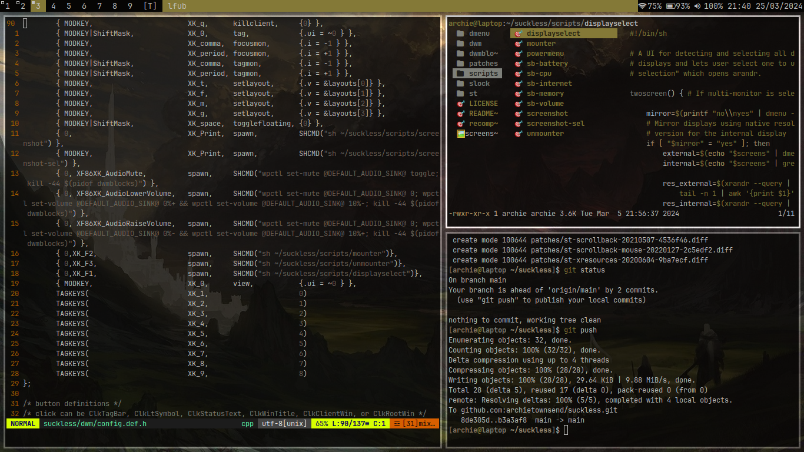

# Archie's dwm & dwmblocks build.
My build of dwm & dwmblocks. 

# dwm patches installed
- alwayscenter (centre floating windows)
- autostart (runs autostart.sh on startup)
- statusallmons (status bar to all monitors)
- uselessgap (gaps to windows)
- grid layout
- scratchpads
