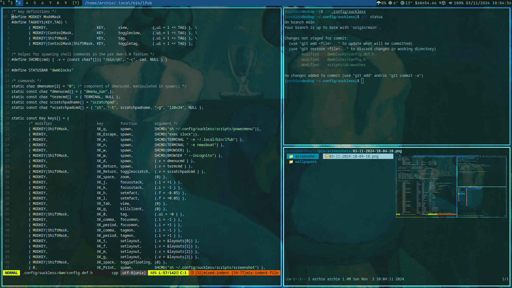

# Archie's patched suckless software

# Info
- Using xresources a colourscheme will be applied to all programs.
- recompile.sh script recompiles all the suckless tools in the directory
- Using [dwmblocks-async](https://github.com/UtkarshVerma/dwmblocks-async)
# dwm patches
- alwayscenter (centre floating windows)
- vanitygaps (gaps between windows)
- scratchpads
- warp (moves cursor to selected window)
- swallow (hides terminal when opening applications, like mpv)
- statuscmd (allows dwmblocks to be clickable)
# st patches
 - scrollback
 - alpha (transparency)
 - xresources (colourscheme)
# slock patches
- capscolor
- xresources
# Credits
- Some of the scripts from this repo have been copied and altered from repos made by [Luke Smith](https://github.com/lukesmithxyz) and [Jake@Linux](https://github.com/jdpedersen1).
